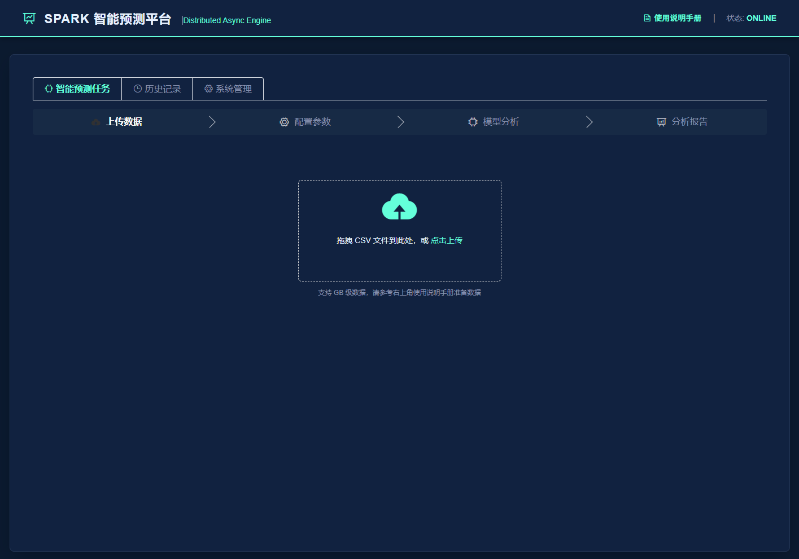
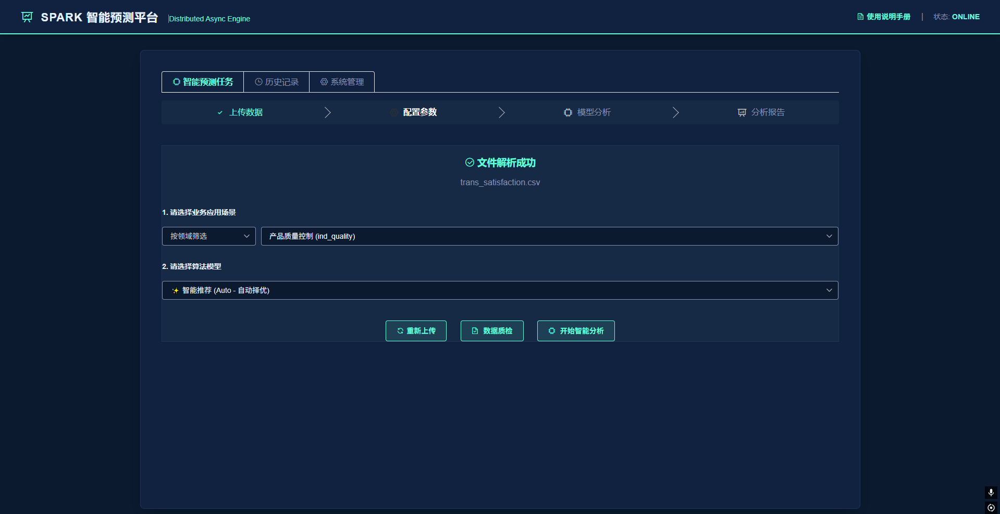
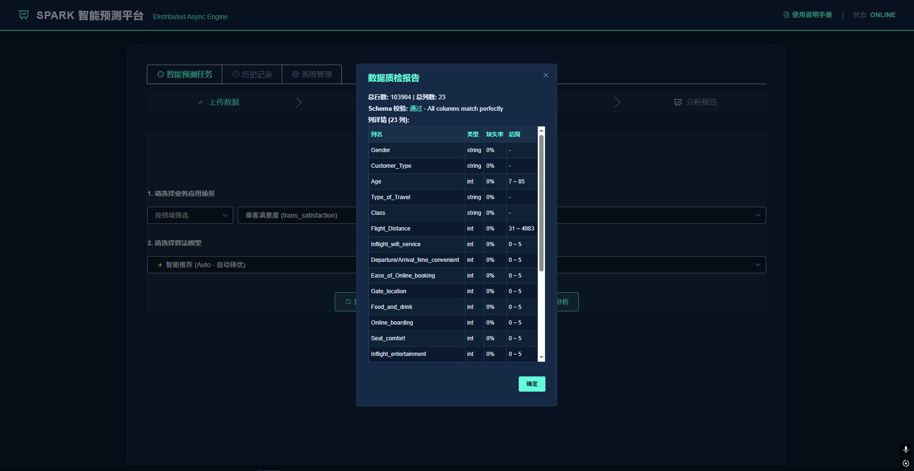
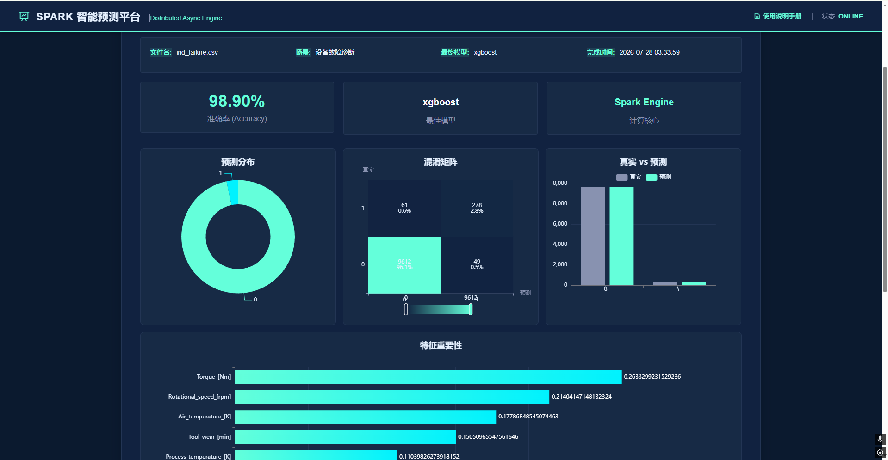
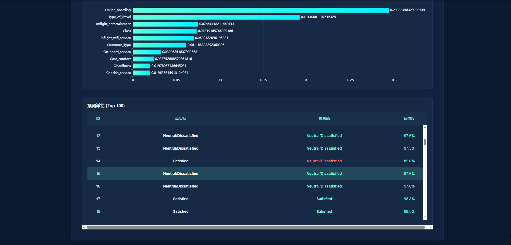
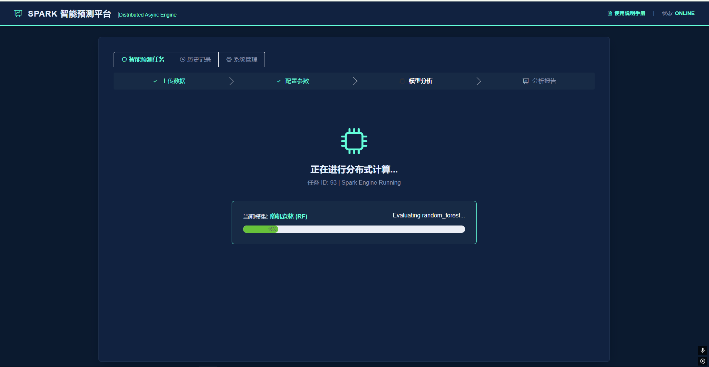
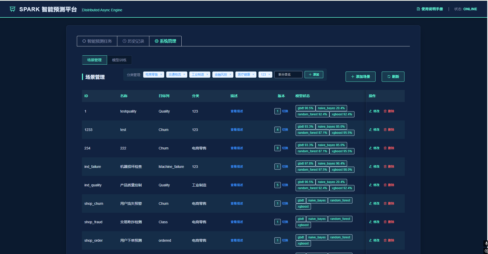
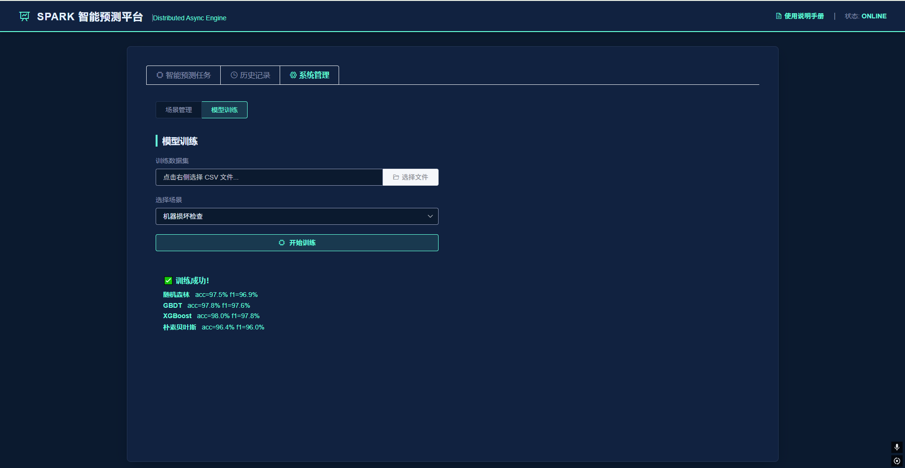
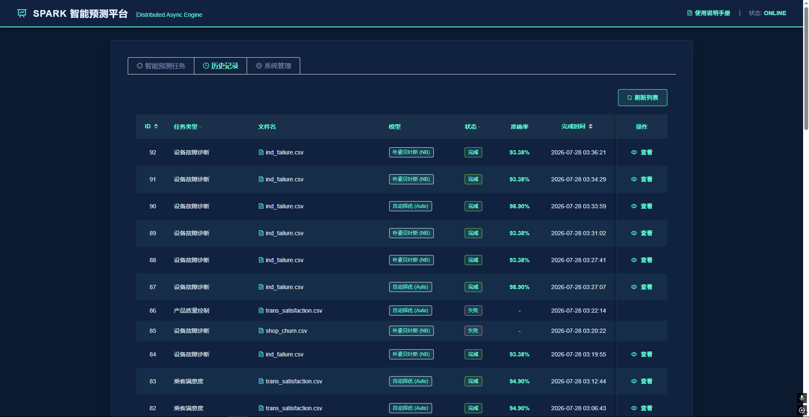

# Spark 大数据快速分类系统

> 基于 PySpark + Flask 的大数据分类预测平台，支持多种机器学习模型

---

## 项目简介

Spark 大数据快速分类系统是一个基于 PySpark 分布式计算框架的企业级分类预测平台。系统以 Flask 为 Web 服务、Vue.js 为前端，集成随机森林、GBDT、XGBoost、朴素贝叶斯四种机器学习算法，提供从数据上传、质量检测、模型训练、版本管理到分类预测的完整闭环。支持场景化管理，可灵活配置不同业务场景的模型参数和特征列，适用于用户流失预测、交易欺诈检测、航班延误分析、设备故障诊断等多种大数据分类场景。

## 核心功能

- **智能分类预测**：上传 CSV 数据，自动择优或手动选择模型，一键完成分布式预测分析
- **数据质量检测**：自动校验数据格式与场景匹配度，生成列级缺失率、数据类型、值范围报告
- **多模型训练**：一键训练随机森林、GBDT、XGBoost、朴素贝叶斯四种模型，自动保存最优版本
- **场景化管理**：支持多业务场景的独立配置，包括目标列、特征列、分类标签等
- **版本切换**：模型训练后自动保存版本，可在不同版本间灵活切换
- **可视化结果**：饼图、混淆矩阵、特征重要性、条形图等多维度结果展示
- **历史回溯**：分页查询历史预测任务，支持按场景筛选和结果查看

## 功能模块

| 模块 | 说明 |
|------|------|
| 分类预测 | 上传数据、选择场景和模型、数据质检、查看分析结果 |
| 历史记录 | 翻页浏览历史任务，支持场景筛选 |
| 系统管理 | 场景管理与分类配置、模型训练与版本切换 |

## 技术栈

### 前端

| 技术 | 用途 |
|------|------|
| Vue.js 2 | 前端框架 |
| Element UI | UI 组件库 |
| ECharts 5 | 数据可视化 |
| Axios | HTTP 请求 |

### 后端

| 技术 | 用途 |
|------|------|
| Python 3.10 | 开发语言 |
| Flask 2.x | Web 框架 |
| PySpark 3.x | 分布式计算引擎 |
| Scikit-learn 1.x | 机器学习 |
| XGBoost 1.x | 梯度提升模型 |

### 数据与存储

| 技术 | 用途 |
|------|------|
| SQLite | 任务记录存储 |
| YAML | 场景配置管理 |
| Parquet | 数据缓存加速 |
| Java JDK 21 | Spark 运行环境 |

## 项目结构

<pre>
BigDataClassifier/
├── backend/               # Flask 后端、Spark 引擎、模型训练
│   ├── app.py
│   ├── admin_routes.py
│   ├── spark_utils.py
│   ├── train_sklearn.py
│   ├── scenes.yaml
│   ├── datasets/
│   └── utils/
├── frontend/
│   └── index.html         # Vue.js 单页应用
├── models/                # 已训练模型文件
├── data/                  # 上传文件与缓存
├── jars/                  # Spark 扩展 JAR
├── screenshots/           # 系统截图
├── requirements.txt
└── README.md
</pre>

## 界面预览
### 首页

### 配置参数

### 数据质检

### 分类结果

### 评估指标

### 场景管理

### 模型训练

### 历史记录

## 搭建环境

- Python 3.10.2
- Java 21
- Windows

## 快速开始

`Bash
# 1. 安装依赖
pip install -r requirements.txt

# 2. 启动后端
python backend/app.py

# 3. 打开浏览器访问
http://localhost:5000
`
